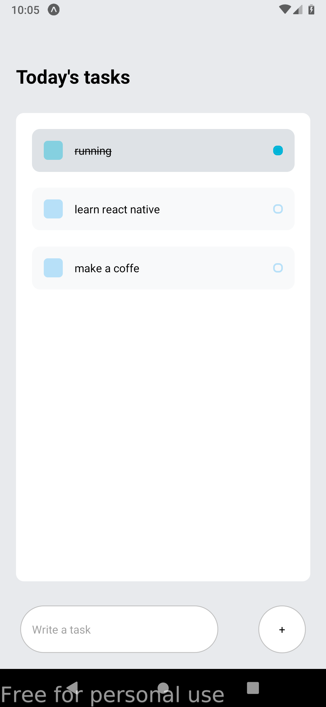

# Todo List

This simple mobile apps build by `React Native` and `Expo`. Create todo and mark done todo.

## Visual



## Installation

Use the package manager [expo](https://docs.expo.dev/) to install as global.

```bash
yarn install
```

or

```
npm install
```

## Usage

```
expo start
```
